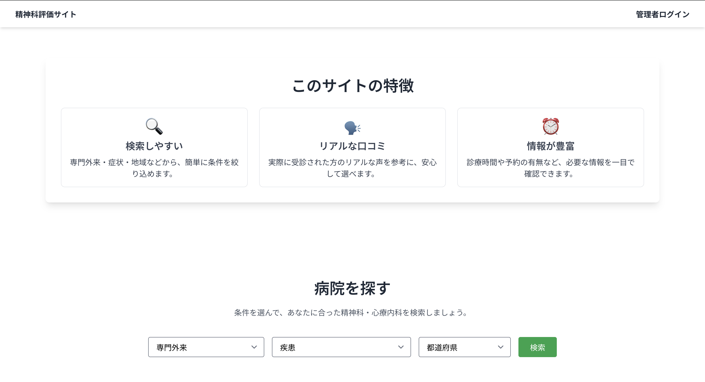
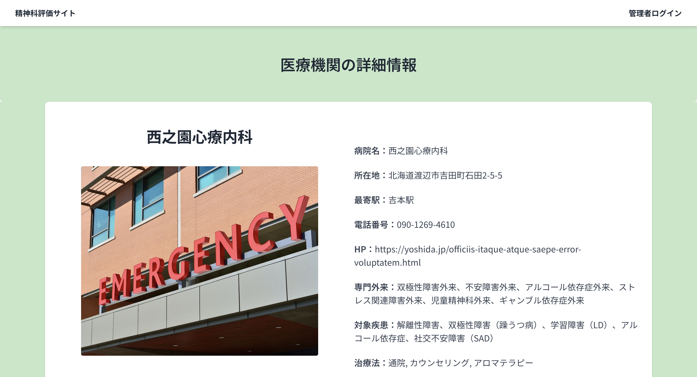
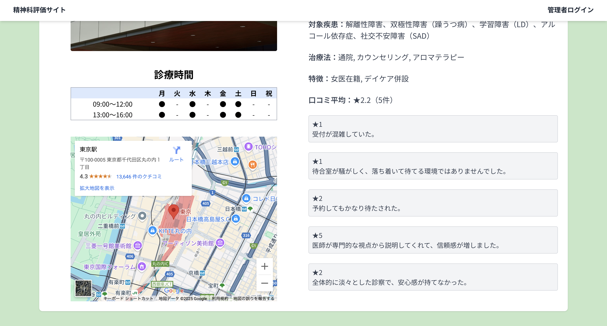
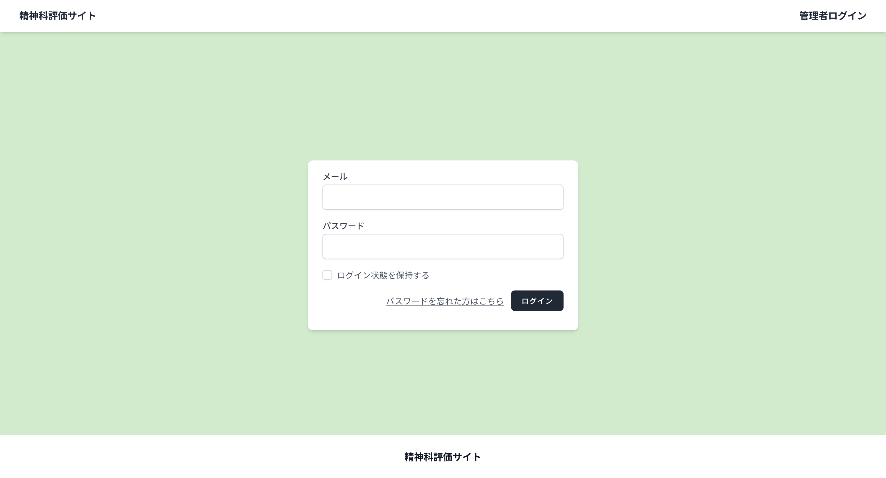
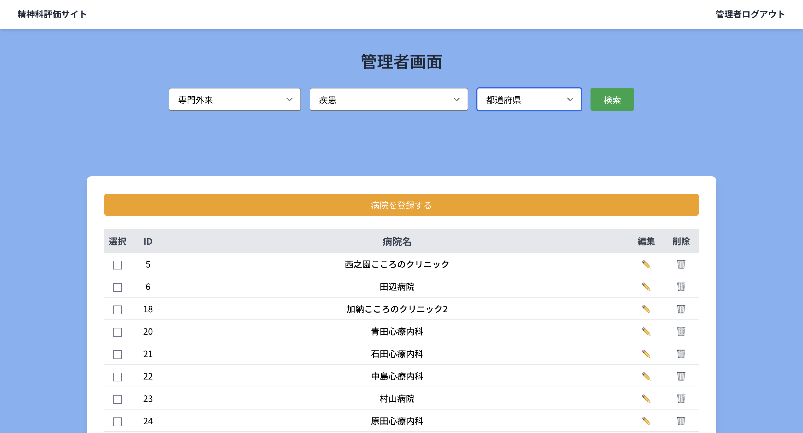
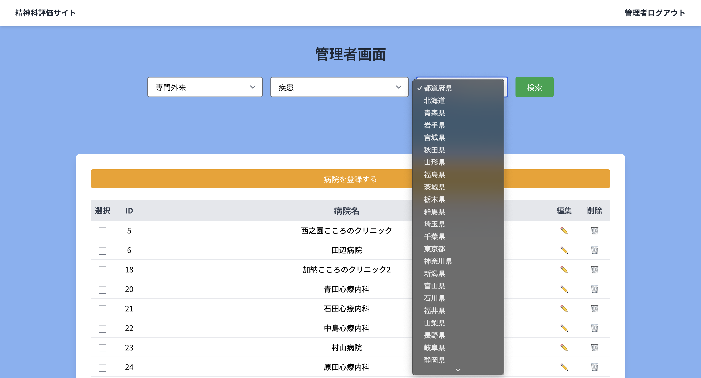
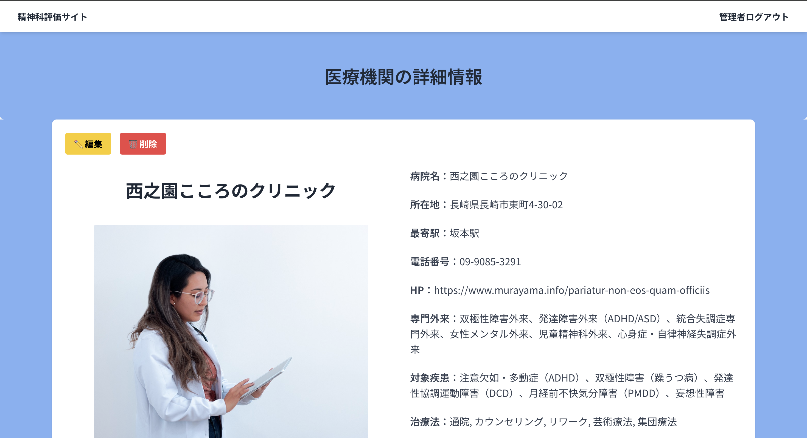
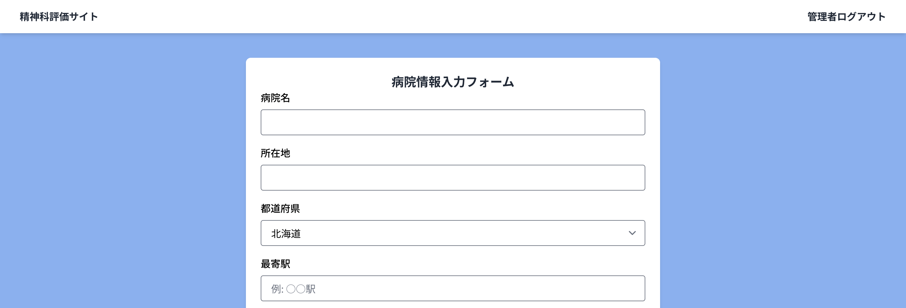
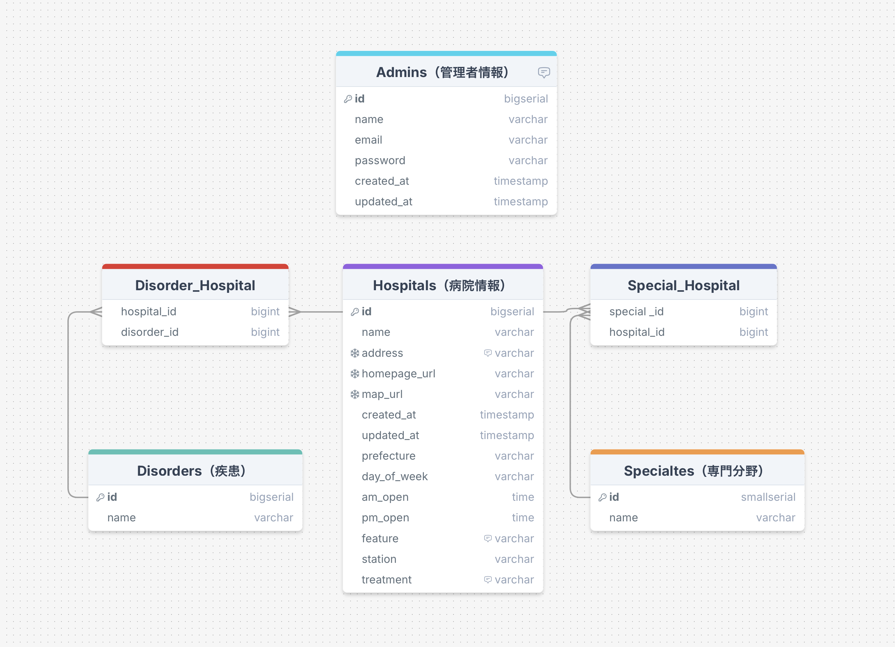

# 精神科評価サイト

このアプリは、精神科の受診を検討している方が、自分に合った医療機関を検索・比較できることを目的としたWebアプリケーションです。

精神科医療の多くは予約制であり、医療機関ごとに得意とする分野や対象疾患が異なります。
私自身が実際に精神科病院で勤務してきた経験から、「精神科に特化した情報を一元的に整理し、患者さんがスムーズに受診先を検討できるサービスが必要ではないか」と感じ、このアプリを開発しました。

病院情報はすべてダミーデータで構成されており、本来であれば実在する医療機関の情報を反映したいところですが、Google Places APIには利用制限があるため、商用ではないポートフォリオ用途での実データ取得は見送る判断をしました。
今後は、ダミーデータを活用したUI改善に加え、他の外部APIの活用なども視野に入れつつ、機能強化や検索体験の向上に取り組んでいく予定です。

## スクリーンショット

### トップページ




### 検索画面


### 検索結果


### 詳細画面



### 管理者ログイン画面


### 管理者画面


## 主な機能

### ① 病院検索機能(ユーザーは専門外来、疾患、都道府県から探せます)


### ② 病院の口コミが見れます


### ③ 管理者ログインにて医療機関の登録・編集・削除ができます





```管理者アカウント```
メールアドレス:admin@example.com
パスワード:password

## URL
https://psychiatric-review-site.fly.dev

## 使用技術

### バックエンド
- PHP 8.2
- Laravel 12（Sail環境、Breezeによる認証機能）
- Composer（PHPパッケージ管理）

### フロントエンド
- HTML5
- Blade（Laravel標準のテンプレートエンジン）
- Tailwind CSS
- JavaScript（ES6+）

### データベース
- PostgreSQL
- Laravelのマイグレーション／Seeder／Factoryを活用し、ダミーデータ生成を実施

### 開発環境
- Docker / Laravel Sail
- Git / GitHub

### デプロイ
- Fly.io

### その他
- このアプリは Fly.io の無料プランを利用してデプロイされています。
そのため、初回アクセス時や一定時間アクセスがない場合は、サーバーがスリープ状態から復帰するため、立ち上がりに数十秒かかることがあります。
アクセス時にエラーが出た場合は、お手数ですが数秒待ってからページをリロードしてください。自動的にサーバーが起動し、アクセスできるようになります。

## ER図

